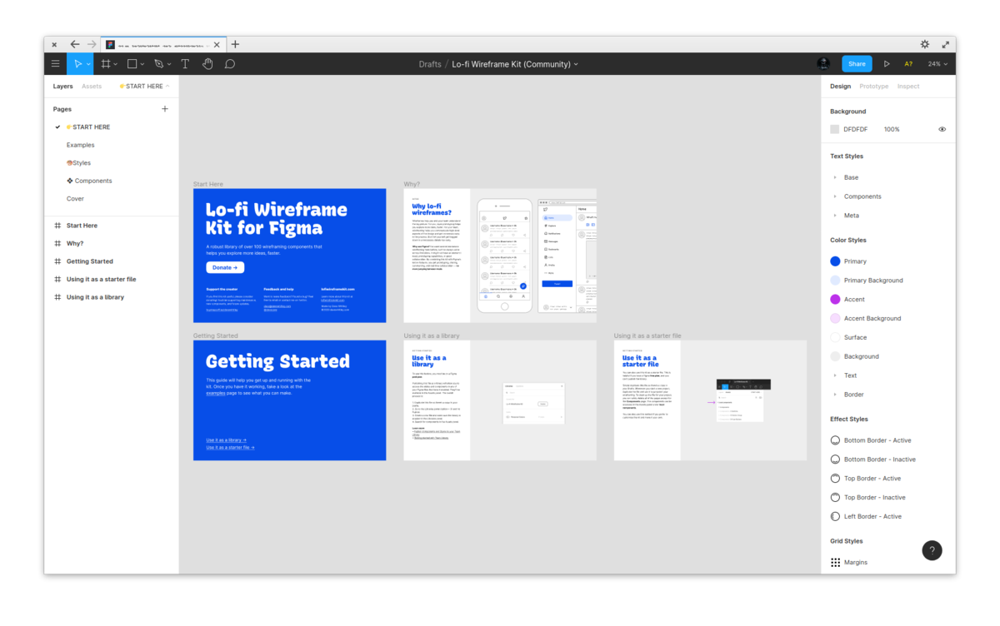

# Web apps based on Firefox
Simple guide to create web apps using Firefox in elementary OS.

## How to create app?
1. Create new profile in `about:profiles`.
    - !tip: change new profile back to default

2. Change settings as needed. (mostly optional)
    - Language and Appearance > Fonts and Colors > Advanced > Proportional: Sans Serif
    - Files and Applications > Digital Rights Management (DRM) Content > Play DRM-controlled content: turn on
    - Browsing > Recommend extensions as you browse, Recommend features as you browse, Enable picture-in-picture video controls: turn off
    - Network Settings > Settings > Enable DNS over HTTPS: turn on
    - **Home > New Windows and Tabs > Custom URLs...**
    - Browser Privacy > Enhanced Tracking Protection > Strict: turn on
    - Browser Privacy > Logins and Passwords: turn off all
    - Firefox Data Collection and Use: turn all off
    - Security > HTTPS-Only Mode > Enable HTTPS-Only Mode in all windows: turn on

3. install extensions and change settings
    - uBlock Origin (optional)
    - Multiple Paste and Go Button (optional)
    - New Tab Override > Option: current home page, Tab Position: default, Focus: turn on set focus

4. customize UI
    - Density: compact
    - Nav bar: remove everything
    - Title bar: add Preferences after new tab

5. change settings in `about:config`
    - `identity.fxaccounts.enabled`: false (disables sync)
    - `ui.key.menuAccessKeyFocuses`: false (don't show menu on alt press)
    - `toolkit.legacyUserProfileCustomizations.stylesheets`: true (enable custom css)

6. copy or link chrome folder to `/home/$USER/.mozilla/firefox/profile.name`

7. create desktop file (via AppEditor from AppCenter)
    - exec line should be `firefox -P profile-name`
    - !tip: icons placed in `~/.local/share/icons` will show in available icons

### Specific app tweaks
#### Figma
1. [fix zooming speed with "Ctrl+Mouse Scroll"](https://spectrum.chat/figma/feature-requests/zooming-speed-with-ctrl-mouse-scroll-on-firefox-differs-from-googles-chrome~250fac37-73e9-4319-b38a-297bf4db5843) > change value of mousewheel settings in `about:config` (1000 seems good to me)
    - `mousewheel.with_control.delta_multiplier_y`
    - `mousewheel.with_shift.delta_multiplier_y`
    - `mousewheel.with_alt.delta_multiplier_y`

## Credits
<https://github.com/Zonnev/elementaryos-firefox-theme> - from where i borrowed few lines of css.
