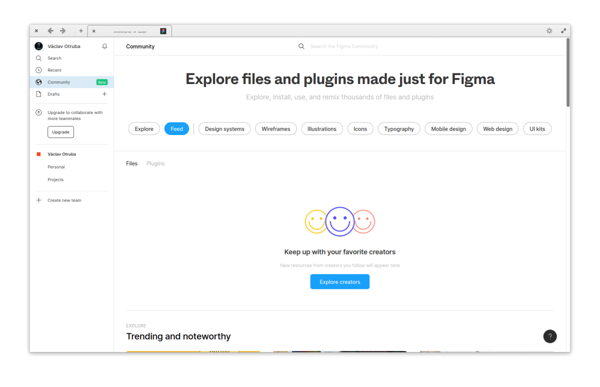

# Web apps based on Firefox
Simple guide to create web apps using Firefox in elementary OS.

## How to create app?
1. Create new profile in `about:profiles`.
    - *!tip: change new profile back to default*

2. Change settings as needed.
    - Home > New Windows and Tabs > Custom URLs... (**required**)

3. install extensions and change settings
    - New Tab Override > Option: current home page, Tab Position: default, Focus: turn on set focus (**required**)
    - uBlock Origin (optional)
    - Multiple Paste and Go Button (optional)

4. customize UI
    - Nav bar: remove everything
    - Title bar: add Preferences, Downloads, Paste and Go at the end and New Tab at the start
    - Bookmarks Toolbar: Never Show

5. change settings in `about:config`
    - `identity.fxaccounts.enabled`: false (disables sync)
    - `ui.key.menuAccessKeyFocuses`: false (don't show menu on alt press)
    - `toolkit.legacyUserProfileCustomizations.stylesheets`: true (enable custom css)

6. copy or link chrome folder to `/home/$USER/.mozilla/firefox/profile.name`

7. create desktop file (via AppEditor from AppCenter)
    - exec line should be `firefox -P profile-name --class profile-name`
    - *!tip: icons placed in `~/.local/share/icons` will show in available icons*

## Credits
<https://github.com/Zonnev/elementaryos-firefox-theme>